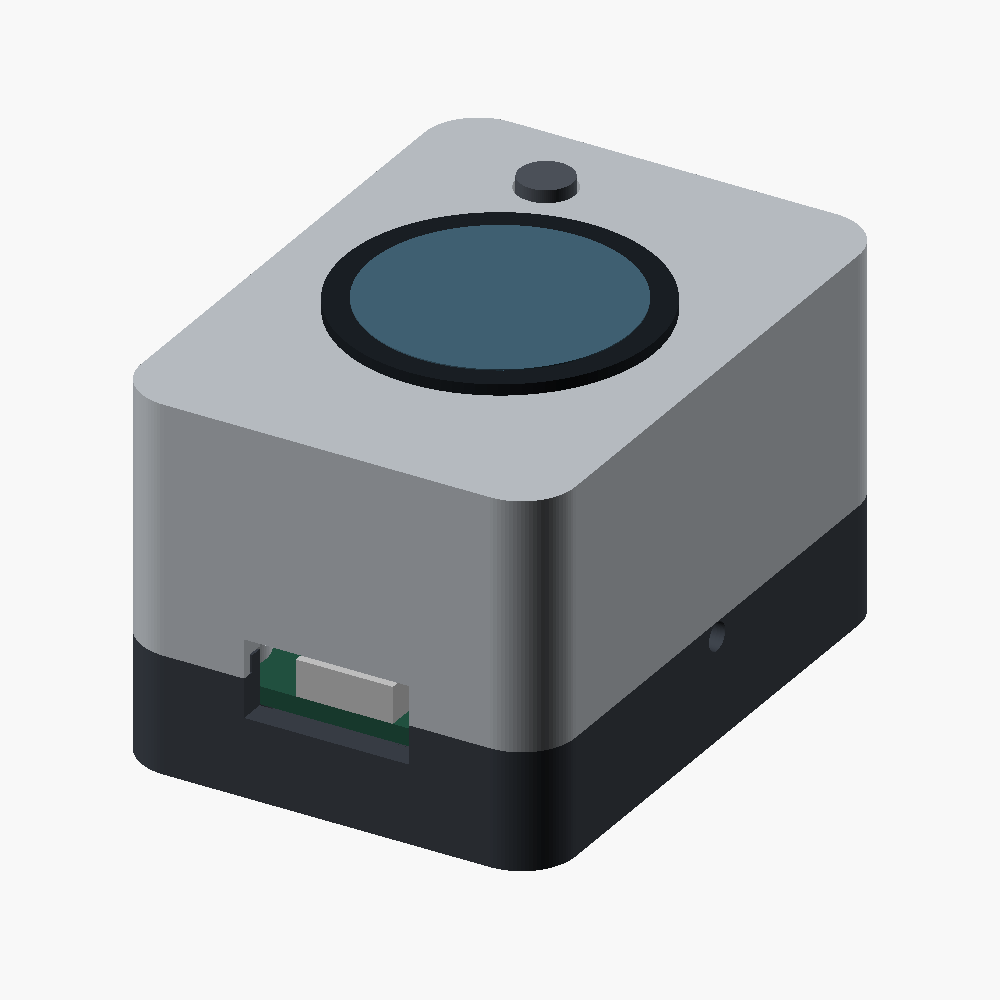

# case



Rounded two-piece shell, USB-C at the front, screws underneath. The body is
39.4 x 53.4 x 33 mm around the 34 x 48 mm PCB. The sensor and button project
above it. [immurok](https://github.com/immurok/hardware) was a packaging reference.

[source](fingerthing.scad) and [parts](parts/) use millimetres. OpenSCAD 2021.01
exports the base upright, lid upside down and button upright:

```sh
for part in base lid button; do
    openscad -D "part=\"$part\"" --export-format binstl -o "case/parts/$part.stl" case/fingerthing.scad
done
```

The board sits 7 mm above the bottom. Four M2.5 x 10 screws pass through its
mounting holes into nuts in the lid. Nut pockets are 5.3 mm across flats and
2.4 mm deep. Screw head recesses are 5.2 mm wide and 2.4 mm deep. Use hardware
that fits these pockets, without washers against components.

Fit the sensor through the 25.5 mm opening and secure it with its supplied nut.
Insert the button from inside the lid, then the four nuts. Connect the sensor
cable before seating the board on the base supports and closing the shell.
BOOTSEL and SWD require opening the case. A side hole faces the status LED.

The [documented R503](../hardware/sensor.md) is 28 mm wide and 19 mm tall.
Its flange and nut are only approximate in the assembly view. The PCB and
component blocks in that view are clearance guides, not complete board models.

The three meshes are closed single pieces. Geometry checks cover the shell
joint, button at rest and 0.6 mm down, sensor opening and the board guides.
These checks do not prove that the supplied module, cable or USB plug fits.
Measure those before printing. Print a fit sample before committing to the shell.

`sensor_hole`, `fit`, `pcb_z` and `button_gap` adjust the fit. The switch's
[specified height](https://www.we-online.com/components/products/datasheet/434133025816.pdf)
is 2.5 mm. The default button gap is 0.35 mm. Check that it releases fully and
does not preload the switch before storing credentials. Print tolerances and
button travel still need a physical check.
